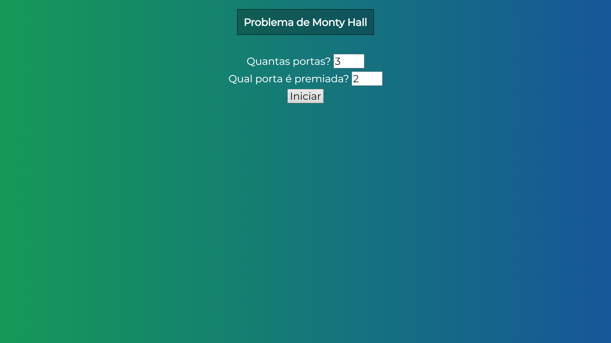
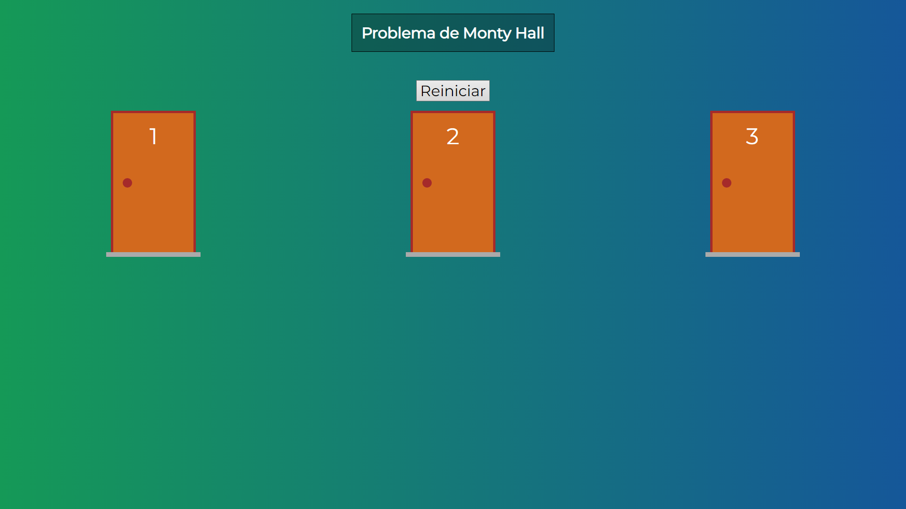
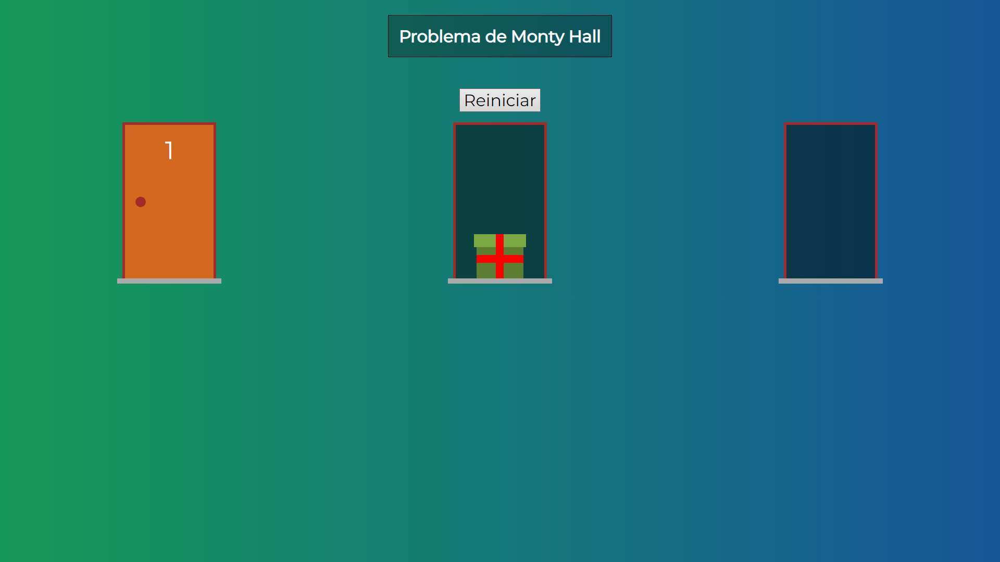

# Montyhall problem made with Vue.js

This project was developed as part of an online course called "Web Moderno".

## What is the Montyhall problem?

The Monty Hall problem is a probability puzzle named after the host of the game show "Let's Make a Deal," Monty Hall. In the problem, you are presented with three closed doors, behind one of which is a valuable prize, and behind the other two are goats. You choose one door, and then Monty, who knows what is behind each door, opens one of the remaining two doors to reveal a goat. Now, you are given the opportunity to either stick with your original choice or switch to the other unopened door. The question is: What is the best strategy to maximize your chances of winning the prize? Surprisingly, the optimal strategy is to switch doors, as it doubles your probability of winning from the initial 1/3 to 2/3.

## Form page



This page serves as the initial interface of the website, allowing you to select the number of doors and indicate which door conceals the prize.

## The doors



This page provides you with the option to choose and open doors.

## Opening the doors



By clicking on the door knobs, you can open the doors and discover their contents, which can either be a gift or nothing at all.

## Technologies


## Project setup
```
npm install
```

### Compiles and hot-reloads for development
```
npm run serve
```

### Compiles and minifies for production
```
npm run build
```

### Lints and fixes files
```
npm run lint
```

### Customize configuration
See [Configuration Reference](https://cli.vuejs.org/config/).
